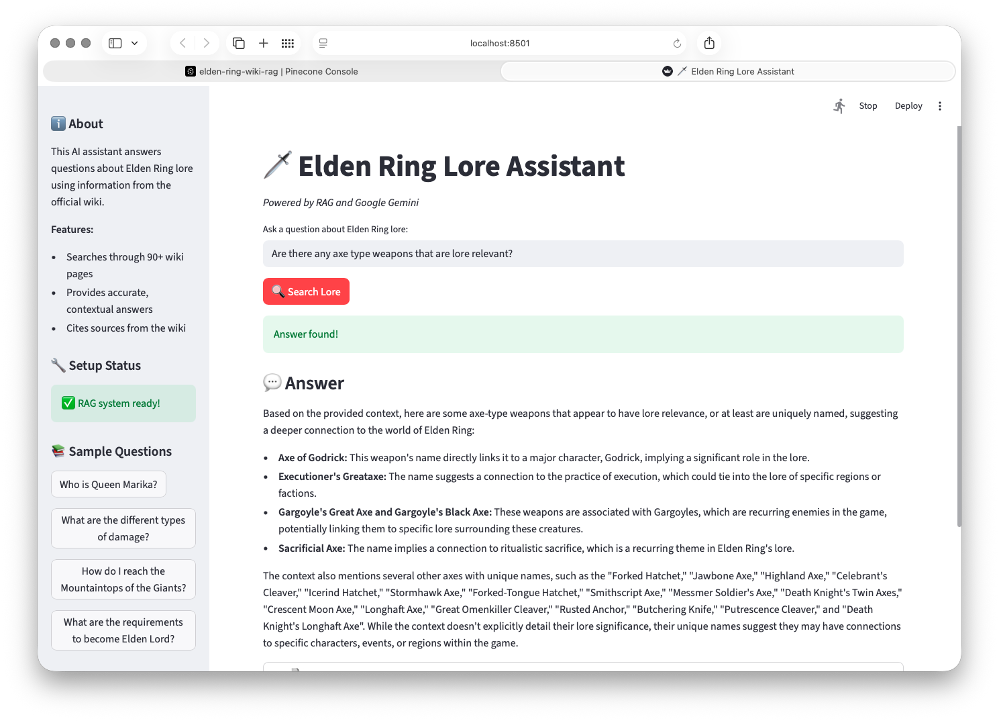

# Elden Ring Wiki RAG System

An AI-powered question-answering system for Elden Ring lore using Retrieval-Augmented Generation (RAG). Ask questions about the game's world, characters, mechanics, and story, and get accurate answers sourced directly from the official wiki.

 
 

## Features

- **Intelligent Q&A**: Answer complex questions about Elden Ring lore using advanced RAG technology
- **Source Citations**: Every answer includes references to specific wiki pages with relevance scores
- **Comprehensive Coverage**: Trained on 93+ wiki pages covering characters, locations, items, mechanics, and story
- **Fast Responses**: ~2-3 second response times using optimized embeddings and vector search
- **Web Interface**: Clean, user-friendly Streamlit app for easy interaction
- **Modular Architecture**: Separate scripts for data processing, indexing, and querying

## Tech Stack

### Core Technologies

- **Language**: Python 3.13
- **RAG Framework**: LangChain
- **LLM**: Google Gemini 2.5 Flash Preview
- **Embeddings**: Sentence Transformers (all-MiniLM-L6-v2, 384 dimensions)
- **Vector Database**: Pinecone (cosine similarity)
- **Web Framework**: Streamlit

### Data Processing

- **Web Scraping**: requests + BeautifulSoup4
- **Data Handling**: pandas, JSON
- **Text Chunking**: RecursiveCharacterTextSplitter (1000 chars, 200 overlap)

### Development Tools

- **Environment**: Python virtual environment (.env/)
- **Dependencies**: requirements.txt
- **API Management**: direnv (.envrc)
- **Version Control**: Git

## Quick Start

### Prerequisites

- Python 3.13+
- direnv (for API key management)

### 1. Clone and Setup

```bash
git clone <repository-url>
cd elden-ring-wiki-rag
python -m venv .env
source .env/bin/activate
pip install -r requirements.txt
```

### 2. API Keys Setup

Create a `.envrc` file in the project root:

```bash
export PINECONE_API_KEY="your_pinecone_api_key_here"
export GOOGLE_API_KEY="your_google_gemini_api_key_here"
```

**Get API Keys:**

- **Pinecone**: Sign up at [pinecone.io](https://app.pinecone.io/) (free tier available)
- **Google Gemini**: Get key at [Google AI Studio](https://makersuite.google.com/app/apikey) (free tier available)

### 3. Run the Application

```bash
streamlit run app.py
```

## Project Structure

```
├── data/
│   ├── raw_html/          # Cached scraped wiki pages (92 files)
│   └── cleaned_data.json  # Processed wiki content (93 pages, 5M+ chars)
├── scripts/
│   ├── scrape.py          # Wiki scraping and caching
│   ├── process.py         # HTML cleaning and JSON structuring
│   ├── setup_pinecone.py  # Vector database initialization
│   ├── chunk_data.py      # Text chunking with LangChain
│   ├── index_data.py      # Embedding generation and Pinecone upload
│   ├── query_rag.py       # RAG query system and API
│   └── test_pipeline.py   # Component validation tests
├── app.py                 # Streamlit web interface
├── requirements.txt       # Python dependencies (15 packages)
├── USAGE.md              # Detailed usage guide
└── readme.md             # This file
```

## Development Steps

### Data Pipeline

1. **Scraping** (`scripts/scrape.py`): Discover and download wiki pages
2. **Processing** (`scripts/process.py`): Clean HTML, extract text, structure as JSON
3. **Chunking** (`scripts/chunk_data.py`): Split text into overlapping chunks
4. **Indexing** (`scripts/index_data.py`): Generate embeddings, upload to Pinecone

### Query Pipeline

1. **Embedding** (`query_rag.py`): Convert user query to vector
2. **Retrieval** (`query_rag.py`): Find top-5 similar chunks in Pinecone
3. **Generation** (`query_rag.py`): Use Gemini to generate answer with context

### Testing

```bash
# Test all components
python scripts/test_pipeline.py

# Individual components
python scripts/scrape.py      # Scrape wiki pages
python scripts/process.py     # Clean and structure data
python scripts/chunk_data.py  # Create text chunks
python scripts/index_data.py  # Generate embeddings and index
```

## System Performance

- **Data Volume**: 93 wiki pages, 5M+ characters of clean text
- **Chunk Strategy**: 1000-character chunks with 200-character overlap
- **Embedding Model**: 384-dimensional vectors, cosine similarity
- **Retrieval**: Top-5 most relevant chunks per query
- **Response Time**: 2-3 seconds (embedding + search + generation)
- **Accuracy**: Context-aware answers with source citations

## Usage Examples

The system can answer questions like:

**Character Lore:**

- "Who is Queen Marika and what is her role in the story?"
- "Tell me about the relationship between Radagon and Rennala"

**Game Mechanics:**

- "What are the different types of damage in Elden Ring?"
- "How do status effects work?"

**World Exploration:**

- "How do I reach the Mountaintops of the Giants?"
- "What are the requirements for becoming the Elden Lord?"

**Items & Equipment:**

- "What are the best weapons for a strength build?"
- "How do I get the Moonlight Greatsword?"

## API Reference

### EldenRingRAG Class

```python
from scripts.query_rag import EldenRingRAG

rag = EldenRingRAG()
answer, sources = rag.answer_question("Who is Malenia?")
```

**Methods:**

- `retrieve_relevant_chunks(query, top_k=5)`: Get relevant text chunks
- `answer_question(question)`: Get full answer with sources

## License

This project is for educational purposes. Elden Ring content and trademarks belong to FromSoftware Inc. and Bandai Namco Entertainment Inc.
